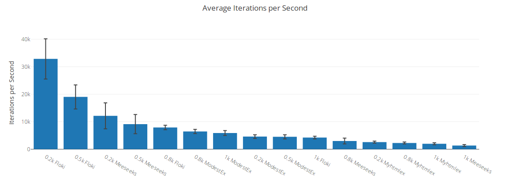
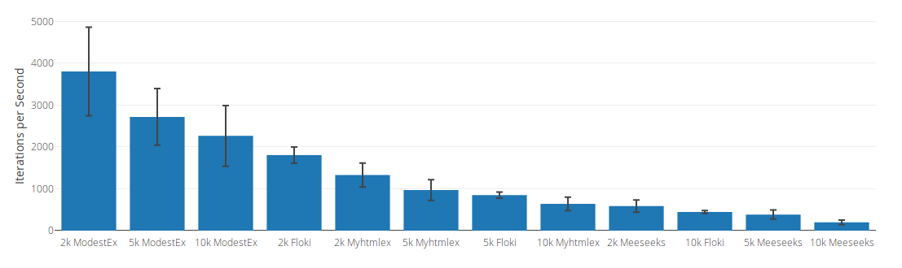
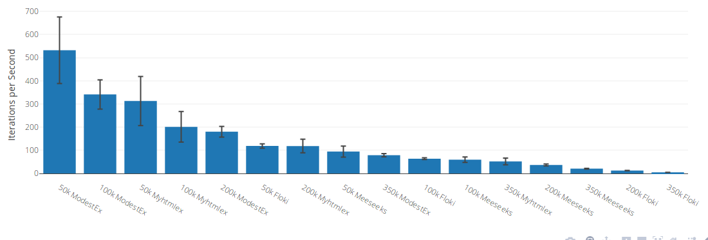

*I do not intend to give a complete analysis here. If something is missing or plain wrong send me a message or feel invited to participate in the [forum discussion](https://elixirforum.com/t/overview-of-available-html-tools-in-elixir/12905).*

# Html tools in Elixir

The landscape of available Elixir packages for html tooling is overseeable but in that sense also very focused. Each library is there for a distinct use case.

|Library |HTML5 compliant|Can decode html|Can handle open tags|Supports common CSS selectors|Supports custom CSS selectors|Can manipulate nodes| Use Case |
|--|--|--|--|--|--|--|--|
|[Floki](https://github.com/philss/floki)         | no with default parser; yes with [html5ever](https://github.com/servo/html5ever) parser (*) | yes | yes | yes (22) | [non-standard selector implemented](https://github.com/philss/floki#supported-selectors) | yes, but [limited](https://hexdocs.pm/floki/Floki.html#map/2) | parse and select |
|[Meeseeks](https://github.com/mischov/meeseeks)  | yes with [meeseeks_html5ever](https://github.com/mischov/meeseeks_html5ever) (*) | yes | yes | yes (27) | yes |no | HTML and XML; custom selectors; CSS and XPath |
|[Myhtmlex](https://github.com/Overbryd/myhtmlex) | yes, as a binding to [myhtml](https://github.com/lexborisov/myhtml) library | yes | yes | | | | fast decode/encode |
|[ModestEx](https://github.com/f34nk/modest_ex)   | yes, as a binding to [Modest](https://github.com/lexborisov/Modest) library | no | yes | yes (36) | [non-standard selector implemented](https://github.com/f34nk/modest_ex/blob/master/SELECTORS.md)  | yes | pipeable string transformations |

(*) There is also a **separate** benchmark availbale for [Meeseeks vs. Floki Performance](https://github.com/mischov/meeseeks_floki_bench).


## Test

	git clone
	mix deps.get

The `test` folder contains examples of the library features side by side.

	mix test

## Benchmark

Run benchmarks with:

	mix bench

and

	mix benchee

On my AMD FX-8300 Eight-Core Processor, 15 Gb Ram, Ubuntu 14.04, the benchmarks looks something like this:

```
## FlokiParseBench
bench iterations   average time 
0.2k       50000   41.71 µs/op
0.5k       50000   72.77 µs/op
0.8k       10000   164.35 µs/op
1k         10000   286.88 µs/op
2k          5000   591.70 µs/op
2.5k        2000   771.40 µs/op
3k          2000   969.00 µs/op
5k          1000   1485.40 µs/op
10k          500   3569.99 µs/op
50k          100   16456.71 µs/op
100k          50   31938.40 µs/op
150k          50   59519.66 µs/op
200k          20   74571.50 µs/op
350k          10   208608.20 µs/op
## MeeseeksParseBench
bench iterations   average time 
0.2k       20000   71.90 µs/op
0.5k       20000   84.47 µs/op
0.8k       10000   281.35 µs/op
1k          2000   682.71 µs/op
2k          1000   1883.27 µs/op
2.5k        1000   2082.47 µs/op
3k          1000   2565.92 µs/op
5k          1000   2910.79 µs/op
10k          500   5268.14 µs/op
50k          100   12073.27 µs/op
100k         100   19220.80 µs/op
200k          50   31213.50 µs/op
150k          50   34159.68 µs/op
350k          50   59949.36 µs/op
## ModestExParseBench
bench iterations   average time 
0.8k       10000   145.98 µs/op
1k         10000   209.33 µs/op
2k         10000   221.05 µs/op
0.2k       10000   223.29 µs/op
0.5k       10000   234.10 µs/op
2.5k        5000   277.31 µs/op
5k          5000   350.37 µs/op
3k         10000   405.63 µs/op
10k         5000   753.32 µs/op
50k         1000   1947.19 µs/op
100k        1000   2918.14 µs/op
150k         500   4505.42 µs/op
200k         500   4997.76 µs/op
350k         100   10743.31 µs/op
## MyhtmlexParseBench
bench iterations   average time 
0.5k        5000   383.84 µs/op
0.2k        5000   390.97 µs/op
0.8k        5000   445.09 µs/op
1k          5000   484.99 µs/op
2k          2000   767.33 µs/op
2.5k        2000   827.46 µs/op
3k          2000   944.53 µs/op
5k          2000   1019.53 µs/op
10k         1000   1540.35 µs/op
50k          500   3025.76 µs/op
100k         500   4819.76 µs/op
150k         200   7877.85 µs/op
200k         200   8771.82 µs/op
350k         100   20467.43 µs/op
```





## Conclusions

All parsers except `ModestEx` return html encoded into a list of tuples.

If you are looking for raw parsing and encoding speed of *smallish* html strings you can use `Floki` and `Meeseeks`.

`Floki` offers all common CSS selectors and some limited features to manipulate nodes.

`Meeseeks` is by far the most flexible. You get a custom selector Api and `Meeseeks` is also able to parse **XML**.

If you are looking for a good performance distribution over many file sizes you can use `Myhtmlex`. With that you can encode and decode html super fast.

However, if you don't need encoded html, but you need to do many manipulations on the html string you can use `ModestEx`.

I hope this was helpful.

Best, f34nk
